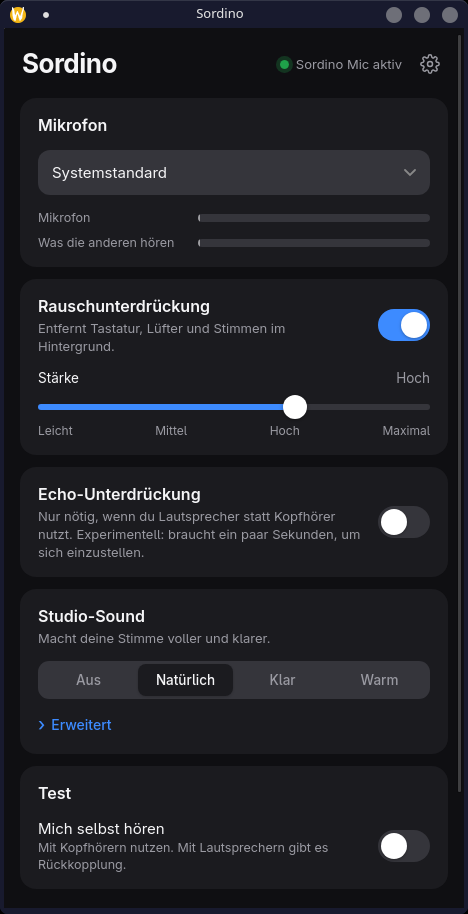

# Sordino

One switch for clean microphone audio on Linux.

Sordino adds a virtual microphone called **Sordino Mic** that removes background noise with
[DeepFilterNet 3](https://github.com/Rikorose/DeepFilterNet) and can add a light "studio" polish on top.
Pick **Sordino Mic** in Discord, Element, Teams, Zoom or OBS and you are done.

<p align="center"></p>

## Features

* **Noise suppression** with four strengths (light to maximum), DeepFilterNet 3. On real speech
  mixed with noise it raises speech quality from PESQ 1.9 to 2.9 on average (STOI 0.95 to 0.97),
  see `tools/eval_quality.py`. Costs roughly 10 to 30 % of one CPU core, depending on the machine.
* **Robust under load**: the processing thread runs with real-time priority, and if the machine is
  still too busy it briefly skips the noise model instead of producing crackle.
* **Clean incoming voices**: a second virtual device, **Sordino Speaker**. Pick it as the output in
  your call app (or make it the default) and Sordino removes noise from the other people before
  it reaches your headphones. It never plays into itself, even when it is the default output.
* **Studio sound** presets (Natural, Clear, Warm) built from low-cut, gate, EQ, de-esser, compressor and
  limiter, plus an "Advanced" view with a few sliders.
* **Echo suppression** for speaker setups (WebRTC AEC3). *Experimental*: it needs a few seconds to adapt.
* **Profile fixer**: a USB mic stuck on the `pro-audio` profile (where most tools silently do nothing) is
  detected and switched to a call-friendly profile with one click.
* **Hotplug**: unplug and replug the microphone, Sordino Mic stays put and picks the mic up again.
* **Test mode**: hear yourself (use headphones), with a hold-to-hear-the-original A/B button.
  Self-monitoring switches itself off if the app goes away, it can never get stuck on.
* **Default microphone** option that restores your previous default when Sordino stops, even after a crash.
* Tray icon, autostart, light and dark theme, English and German.

## Safe by design

* Sordino never writes PipeWire configuration. It is a normal PipeWire client. If it crashes, only
  "Sordino Mic" disappears and the rest of your audio keeps running. (Tested with `kill -9`.)
* Everything runs locally. No account, no telemetry, audio never leaves your machine.
* PipeWire only (with WirePlumber). No PulseAudio-only systems.

## Install

Download a package from the [latest release](https://github.com/BxnnyG/sordino/releases/latest)
(check it with `sha256sum -c SHA256SUMS`):

| System | Command |
|---|---|
| Arch Linux / CachyOS / Manjaro | `sudo pacman -U bxy-sordino-*.pkg.tar.zst` |
| Debian 13+, Ubuntu 24.04+ | `sudo apt install ./bxy-sordino_*_amd64.deb` |
| Fedora 40+ | `sudo dnf install ./bxy-sordino-*.rpm` |
| Flatpak (experimental) | `flatpak install --user ./bxy-sordino-*.flatpak` |
| Any other distro | unpack `bxy-sordino-*-x86_64-linux.tar.gz`, run `./install.sh` |

The AUR package `bxy-sordino` is prepared in [packaging/aur](packaging/aur) and will be submitted as soon
as AUR account registration is open again. Until then:
`git clone https://github.com/BxnnyG/sordino && cd sordino/packaging/aur && makepkg -si`
(this downloads the release tarball of the tag in the PKGBUILD).

### Arch from a checkout

```sh
git clone https://github.com/BxnnyG/sordino && cd sordino
packaging/install-arch.sh        # builds a real pacman package and installs it (sudo)
# later: sudo pacman -R bxy-sordino
```

### From source

You need `rust`, `clang`, `nodejs`, `npm`, `pipewire`, `webkit2gtk-4.1`, `libayatana-appindicator` and
for echo suppression `webrtc-audio-processing` (Arch; or `meson` + `ninja`, then build with
`--features sordinod/echo-bundled` to compile WebRTC from the bundled source):

```sh
cd ui && npm ci && npm run build && cd ..
cargo build --release                     # target/release/{sordinod,sordinoctl,sordino}
packaging/stage.sh /tmp/sordino-root /usr    # shows exactly what a package installs
```

## Use

Start **Sordino** from your application menu, or run the daemon and control it from the terminal:

```sh
sordinod &                       # creates "Sordino Mic"
sordinoctl status
sordinoctl noise max             # light | medium | high | max | on | off
sordinoctl studio clear          # off | natural | clear | warm
sordinoctl default on            # make Sordino Mic the system default microphone
sordinoctl fix-profile           # switch a mic from 'pro-audio' to a voice profile
sordinoctl monitor on            # hear yourself, Ctrl+C to stop
sordinoctl speaker on            # clean incoming voices via "Sordino Speaker"
sordinoctl diag                  # glitch counters, DSP priority
sordinoctl devices --all
```

Settings live in `~/.config/sordino/config.toml`.

## How it works

```
mic ─▶ [echo cancel] ─▶ [DeepFilterNet] ─▶ [gate · EQ · de-ess · compress · limit] ─▶ "Sordino Mic"
```

`sordinod` is a user service that talks to PipeWire and exposes a small D-Bus API
(`io.github.bxnnyg.Sordino`). The desktop app and `sordinoctl` are clients of that API. The PipeWire
real-time callbacks only move samples through ring buffers; the DSP runs on its own thread, because the
neural network allocates while it runs. Details and the reasoning behind them are in
[docs/ARCHITECTURE.md](docs/ARCHITECTURE.md) and [CONTRIBUTING.md](CONTRIBUTING.md).

## Troubleshooting

* **I do not hear anything in my app.** Select *Sordino Mic* as the microphone in that app.
* **"Sordino is not running".** Start the app again, or run `sordinod`.
* **Window is blank or crashes on Wayland.** Sordino already sets `WEBKIT_DISABLE_DMABUF_RENDERER=1` and `WEBKIT_DISABLE_COMPOSITING_MODE=1`
  (WebKitGTK problem on some NVIDIA setups). Open an issue with the terminal output.
* Bug reports: please attach `sordinoctl state` and (after checking it for private names) `pw-dump`.

## Status and limits

Early software. Echo suppression is experimental. Sordino adds roughly 30 to 45 ms of delay because the
noise model looks slightly ahead; this is irrelevant for calls but audible when you monitor yourself
with the *processed* signal. The "original" button in the test card is nearly instant.

## License

Free for everyone to use, modify and share under **GPL-3.0-or-later**, with one extra requirement
(GPL section 7(b), see [NOTICE](NOTICE)): the attribution **"Sordino by BxnnyG"** with a link to
<https://github.com/BxnnyG/sordino> must stay visible in the app and the README of every copy or
fork you distribute. Because of the GPL, forks and derived packages that you distribute must also
publish their source code under the same license.

Third-party components keep their own licenses (DeepFilterNet MIT/Apache-2.0, WebRTC audio
processing BSD-3-Clause, Tauri MIT/Apache-2.0).

---

<sub>Sordino by [BxnnyG](https://github.com/BxnnyG/sordino)</sub>
